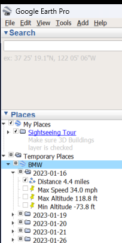
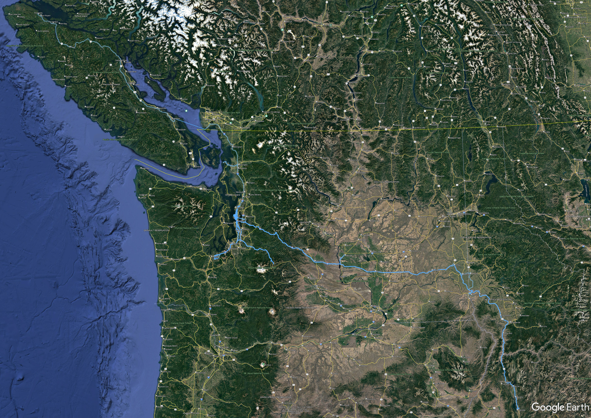
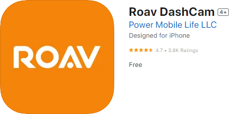

# ROAV-Concat
Concatenate and Organize ROAV Dashcam files into Daily Videos and KML/KMZ files

This program creates daily sped up movies from the ROAV Dashcam recordings. One minute of video time equals one hour of real time. It also creates KMZ track files to be loaded into a program such as google earth to see the recorded dashcam coordinates.




[](https://apps.apple.com/app/id1191396519)
The ROAV Dashcam formats its micro sd card using the FAT32 filesystem and is limited to a maximum sd card size of 128GB.

It creates a directory entry at the root, ROAV, and a directory in ROAV, MOVIES.

\ROAV
????MOVIE

The ROAV Dashcam creates .MP4 and .info files in the MOVIE subdirectory. The dashcam can be configured as to how long each video clip is. I've been using 1 minute, but for the purpose of this program it doesn't matter. I periodically copy the files from the sd card to a local drive. Because of the filename format the filenames should be unique other than the possibility of the hour overlap at the beginning of daylight savings time.

A typical MOVIE directory might look like this:

```
 Directory of \ROAV\MOVIE

01/01/2024  02:47 AM    <DIR>          .
01/01/2024  02:47 AM    <DIR>          ..
01/16/2023  04:13 PM            23,606 2023_0116_160819_001.info
01/16/2023  04:13 PM       700,122,945 2023_0116_160819_001.MP4
01/16/2023  04:15 PM            12,120 2023_0116_161320_002.info
01/16/2023  04:15 PM       356,630,233 2023_0116_161320_002.MP4
01/16/2023  04:51 PM            24,698 2023_0116_164627_003.info
01/16/2023  04:51 PM       700,099,433 2023_0116_164627_003.MP4
01/16/2023  04:56 PM            24,537 2023_0116_165128_004.info
01/16/2023  04:56 PM       700,329,149 2023_0116_165128_004.MP4
01/16/2023  05:01 PM            24,521 2023_0116_165628_005.info
01/16/2023  05:01 PM       700,293,913 2023_0116_165628_005.MP4
```

Because my program uses the xmllite component of windows to create the KML files it would require a major rewrite to make portable to run on linux. https://learn.microsoft.com/en-us/previous-versions/windows/desktop/ms752872(v=vs.85)
```
#include <xmllite.h>
#pragma comment(lib, "xmllite")
```

Run without parameters it gives some very basic information. 

```
ROAV-Concat.exe
command Line Format:
        ROAV-Concat.exe VideoName [-auto][-no mp4][-no kmz][-preset [ultrafast|superfast|veryfast|faster|fast|medium|slow|slower|veryslow]] [-crf [0-28]] PathToFirstFile.mp4 PathToLastFile.mp4
```

I typically run it with the current directory in the ROAV directory, with the parameters BMW and -auto. It will create daily video files with the prefix BMW, and a single KMZ file for the year, from whatever video files are in the MOVIE directory.